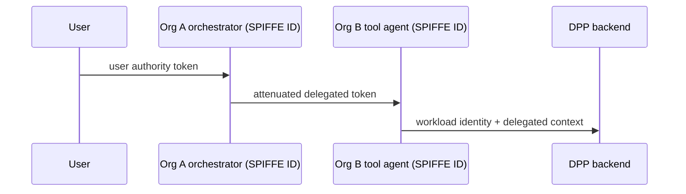

# Two-organization delegation chain

Last verified: 2026-09-05

```mermaid
sequenceDiagram
  participant U as User
  participant OA as Org A orchestrator (SPIFFE ID)
  participant TB as Org B tool agent (SPIFFE ID)
  participant R as DPP backend
  U->>OA: user authority token
  OA->>TB: attenuated delegated token
  TB->>R: workload identity + delegated context
```

Record where the SPIFFE workload binding and on-behalf-of user authority are validated independently.

